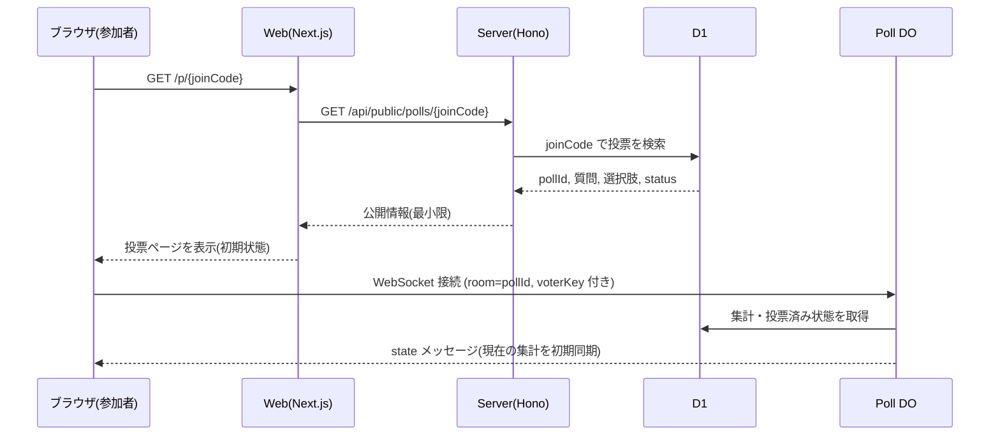
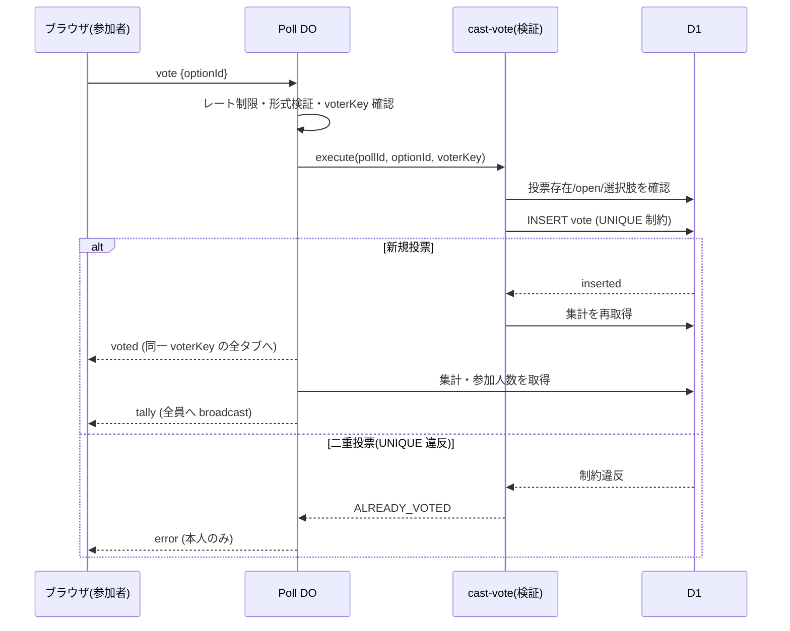
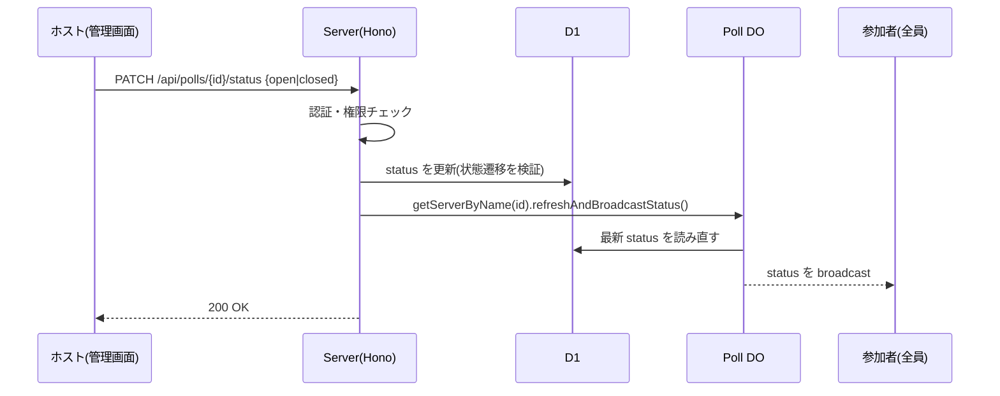

# リアルタイム投票アプリの作り方

ホストが投票を作成・公開し、参加者がその場で投票すると、集計結果が全員の画面へ即座に反映される。こうしたリアルタイム投票アプリをどのような仕組みで実現するかを、実際の実装をもとに解説します。

## 前提

この記事は次の構成を前提とします。

- 実行基盤は Cloudflare Workers です。リアルタイム通信には Durable Objects を使います。
- データベースは Cloudflare D1（SQLite）です。
- サーバは Hono（HTTP）と PartyServer（WebSocket。Durable Objects のラッパー）で構成します。
- クライアントは Next.js（OpenNext で Cloudflare Workers 上に配置）と partysocket（WebSocket クライアント）で構成します。
- 参加者は匿名です。ログインせず、参加コードのみで投票に参加します。

リアルタイム性の核となるのは Durable Objects と WebSocket です。認証や組織管理などの周辺機能には触れません。

## 全体アーキテクチャ

アプリは 2 つの Cloudflare Worker で構成します。1 つは画面を提供する Web Worker（Next.js / OpenNext）、もう 1 つは API とリアルタイム配信を担う Server Worker（Hono + Poll DO）です。データベースの D1 は Worker ではなく、独立した Cloudflare のマネージドサービスです。

```txt
                ┌──────────────── Cloudflare Workers ──────────────────┐
                │                                                      │
 ┌───────────┐  │     ┌───────────────┐       ┌──────────────────────┐ │
 │           │─HTTP──▶│  Web Worker   │─HTTP─▶│     Server Worker    │ │
 │ Browser   │  │     │ (Next.js /    │       │        (Hono)        │ │
 │ (Host /   │  │     │  OpenNext)    │       │                      │ │
 │  Voter)   │  │     └───────────────┘       │  ┌────────────────┐  │ │
 │           ◀═══ WS ═══════════════════════════▶│   Poll DO      │  │ │
 │           │  │                             │  │ (PartyServer)  │  │ │
 └───────────┘  │                             │  └───────┬────────┘  │ │
                │                             └──────────┼───────────┘ │
                │                                        │ read / write│
                └────────────────────────────────────────┼─────────────┘
                                                         ▼
                                             ┌────────────────────────┐
                                             │     Cloudflare D1      │
                                             │        (SQLite)        │
                                             │   poll / option / vote │
                                             └────────────────────────┘
```

通信の経路は次のとおりです。

- ブラウザの HTTP は Web Worker へ向かいます。画面の表示、サーバサイドレンダリング、ホストの公開・締切（Server Actions）はいずれも Web Worker 内のサーバ処理で実行されます。
- Web Worker は、必要なデータを Server Worker の HTTP API から取得します（サーバ間通信。Cookie を引き継ぎます）。投票の作成・公開・締切といった管理操作はこの経路を通り、認証と権限チェックを伴います。
- ブラウザが Server Worker へ直接つなぐのは WebSocket だけです。投票の受付と集計結果の配信を担い、参加者は匿名で接続します。
- Poll DO は Server Worker が公開する Durable Object で、Workers プラットフォーム上で動きます。
- D1 は唯一の信頼できる状態（source of truth）です。集計も投票記録もすべて D1 に保存します。読み書きするのは主に Server Worker（Poll DO を含む）です。

この構成により、状態を変更できるのは検証を通った操作のみとなり、配信経路は読み出しと送信に専念できます。

## Durable Objects を使う理由

通常の Cloudflare Workers はリクエストごとに別インスタンスで実行され、状態を保持しません。複数の参加者が同時に接続する WebSocket では、全接続を 1 か所に集めて同じ集計結果を配信する仕組みが必要です。

Durable Object（DO）は、名前（ID）ごとに世界で 1 つだけ存在するインスタンスです。この性質を使い、**投票 1 件につき DO を 1 つ**割り当てます。DO のルーム名には投票の ID（pollId）を使います。

```txt
poll/abc123  ─▶ Poll DO インスタンス A（投票 abc123 の参加者が集まる）
poll/def456  ─▶ Poll DO インスタンス B（投票 def456 の参加者が集まる）
```

同じ投票に接続する参加者は必ず同じ DO に集約されるため、その DO から `broadcast` を呼べば、接続中の全員へ同じメッセージを配信できます。これがリアルタイム配信の土台です。

PartyServer は、この DO 上に WebSocket のライフサイクル（`onConnect` / `onMessage` / `onClose`）と `broadcast` を提供するライブラリです。

## ルーティング: HTTP と WebSocket の振り分け

Worker のエントリポイントで、リクエストのパスを見て振り分けます。`/parties/poll/<pollId>` への接続は Poll DO へ、それ以外は Hono アプリへ渡します。

WebSocket 接続を DO へ振り分ける前に、`getServerByName`（名前から該当する DO のインスタンスを取得・準備する PartyServer の関数）を呼んで DO の名前を確定・永続化しておく点が実装上の要点です。これを行わないと、後述するハイバネーションからの復帰時に DO が自分のルーム名を解決できず、`onClose` や `onMessage` の処理に失敗することがあります。

## 参加者が投票ルームへ入るまで

参加者は短い参加コード（joinCode）で投票に参加します。コードから投票内容の取得と WebSocket 接続まで、処理は 2 フェーズに分かれます。

第 1 フェーズ（HTTP / サーバサイドレンダリング）では、joinCode から投票内容を取得します。公開用 API は最小限の情報（pollId・質問・選択肢・status）のみ返し、下書き（draft）状態の投票は 404 とします。これにより、未公開の投票の存在は外部に漏れません。

第 2 フェーズ（WebSocket）では、取得した pollId をルーム名として Poll DO へ接続します。接続後はリアルタイム更新に切り替わります。



joinCode は Crockford Base32（紛らわしい I・L・O・U を除いた 32 文字）で 8 文字、40 ビットのエントロピーを持ちます。`crypto.getRandomValues` で生成し、32 = 256 / 8 のためモジュロバイアスは生じません。一意性は生成後に DB で重複を確認し、衝突時は数回リトライして担保します。口頭や手入力でも共有しやすい長さと文字種にしています。

## 匿名参加者の識別: voterKey

参加者はログインしないため、誰が投票したかを識別する値が別途必要です。これを voterKey と呼びます。

voterKey はブラウザ側で生成する不透明な乱数（`crypto.randomUUID`）で、localStorage に保存します。個人情報は一切含みません。「1 ブラウザ = 1 voterKey = 1 票」という設計です。

重要なのは、voterKey を**接続時の URL クエリに固定**し、投票メッセージには含めないことです。投票のたびにクライアントから voterKey を受け取ると、別人の voterKey を詐称して投票を上書きできてしまいます。接続時の URI に固定すれば、その接続からの投票は必ずその voterKey に紐づきます。

## WebSocket メッセージプロトコル

クライアントとサーバの間でやり取りするメッセージは限定します。

クライアント → サーバ（1 種類のみ）:

| type | 内容 |
| --- | --- |
| `vote` | 選択した optionId のみを送る（voterKey は送らない） |

サーバ → クライアント（5 種類）:

| type | 内容 | 配信先 |
| --- | --- | --- |
| `state` | 接続直後の初期同期（status・選択肢・集計・自分の投票状態） | 接続した本人 |
| `tally` | 最新の集計と参加人数 | 全員 |
| `status` | 公開／締切の状態変更 | 全員 |
| `voted` | 投票が確定したこと | 同一 voterKey の全タブ |
| `error` | 締切後・二重投票などの失敗理由 | 該当接続のみ |

クライアントからの入力は `vote` の optionId のみに絞り、それ以外の状態はすべてサーバが決めて配信します。入力の検証範囲を狭く保てます。

## 投票処理の仕組み: サーバ権威

投票はサーバ側で検証し、クライアントの申告を信用しません。DO が `vote` メッセージを受け取ると、次の順で検証してから永続化します。

1. 投票が存在するか
2. status が `open` か（下書き・締切後は拒否）
3. optionId がその投票の選択肢か（別投票の選択肢を弾く）
4. UNIQUE(poll_id, voter_key) 制約による二重投票の拒否



二重投票の防止は、アプリ側のチェックだけに頼らず DB の UNIQUE 制約で最終的に担保します。同時リクエストでもアトミックに 1 票へ収束するためです。実装では INSERT 時の UNIQUE 制約違反を捕捉して「投票済み」と判定します。なお D1（Drizzle 経由）はエラーを多重にラップするため、`cause` の連鎖を辿って制約違反を判定する必要があります。

投票確定後の `voted` は、投票した接続だけでなく**同一 voterKey の全タブ**へ配信します。同じブラウザで複数タブを開いていた場合、投票していないタブのボタンが押せたままだと再投票でエラーになるため、全タブを投票済み状態に揃えます。

## D1 を唯一の状態とする設計

Poll DO は集計や status を自身のメモリにキャッシュしません。配信のたびに D1 から読み直します。

```txt
broadcastTally():
    tally    = D1 から選択肢ごとの得票数を集計
    total    = D1 から総投票数を取得
    全員へ broadcast { tally, total, 参加人数 }
```

DO 内にキャッシュを持たない理由は、ハイバネーションと再起動への耐性です。Durable Object は接続が途切れている間はハイバネーション（休止）し、再接続時に起こされます。このときメモリ上の状態は失われる可能性があります。状態を常に D1 から読めば、休止・再起動をまたいでも集計が正しく復元されます。

WebSocket Hibernation を有効にする（`hibernate: true`）ことで、接続が続く間も DO は休止でき、コストを抑えられます。休止後も維持したい少量の状態（後述のレート制限カウンタ）は、接続オブジェクトの状態（`conn.setState`）に保存します。

## 状態変更の伝播: HTTP から WebSocket へ

ホストが投票を「公開」「締切」すると、その変更を接続中の全参加者へ即座に届ける必要があります。これは HTTP 経路から WebSocket 経路へまたがる処理です。



要点は、HTTP ハンドラから `getServerByName(env.Poll, pollId)` で該当する DO のスタブを取得し、その RPC メソッド（`refreshAndBroadcastStatus`）を呼ぶことです。これにより、別経路である HTTP リクエストの処理中に、WebSocket 側の DO に配信を指示できます。

この配信はベストエフォートです。配信に失敗しても DB の状態変更は成功しているため、HTTP リクエスト自体は失敗させません。参加者は次回の接続時に `state` で正しい status を受け取れます。

status の変更には状態遷移の制約があります。`draft → open` と `open → closed` のみ許可し、`closed → open` のような逆行は拒否します。同じ状態への遷移は冪等に扱います。

## 参加人数の数え方

参加人数は「接続（タブ）数」ではなく「ユニークな voterKey の数」で数えます。同じブラウザで複数タブを開いても 1 人と数え、最後のタブを閉じたときに初めて減ります。

```txt
participantCount():
    keys = 空の集合
    for each 接続 in participant タグの接続:
        keys.add(その接続の voterKey)
    return keys のサイズ
```

PartyServer の `getConnections` は現在開いている接続のみを返すため、`onClose` のたびに再計算すれば人数は自然に増減します。

## 観戦者と参加者の区別

WebSocket には 2 種類の接続があります。両者を接続時のタグで区別します。

| 種別 | 接続方法 | タグ | 人数計上 | 受信メッセージ |
| --- | --- | --- | --- | --- |
| 参加者 | voterKey 付きで接続 | participant | する | state / tally / status / voted / error |
| 観戦者 | voterKey なしで接続 | observer | しない | state / tally / status |

ホストの管理画面はライブ結果を見るために観戦者として接続します。voterKey を付けないため参加人数に計上されず、投票もできません。同じ DO・同じ `broadcast` を使うため、参加者と観戦者は常に同じ集計を見ます。

接続時に URL クエリの voterKey の有無を見てタグを割り当てます。

```txt
getConnectionTags(接続):
    voterKey あり → ["participant"]
    voterKey なし → ["observer"]
```

## クライアント側の表示制御

クライアントは受信したメッセージで React の状態を更新するだけで、表示の計算は持ちません。投票ボタンの活性条件は、status が `open` かつ未投票かつ送信中でなく接続済みであること、というように受信状態から導出します。

送信時には一時的にロックし（楽観的に選択肢をハイライト）、サーバからの `voted` または `error` の応答でロックを解除します。`error` を受け取った場合は理由を提示し、選択状態はサーバの `state` で正しく復元されます。

接続が切れたときは partysocket が自動で再接続を試みます。再接続後は DO が `state` を送って現在の集計へ再同期するため、切断中の差分を考慮する必要はありません。

## 濫用対策

匿名で誰でも接続できるため、多層で防御します。本質的な境界は「サーバ権威の投票検証」と「公開済み情報のみの配信」であり、以下はその補強です。

- **二重投票**: DB の UNIQUE(poll_id, voter_key) 制約で最終担保します。voterKey は接続時の URI に固定し、メッセージでの詐称を防ぎます。
- **クロスサイト WebSocket 乗っ取り（CSWSH）**: 接続時に Origin ヘッダを許可リスト（HTTP の CORS と同一解釈）と照合します。ブラウザは Origin を必ず付与するため、欠落時（非ブラウザ直結）はブラウザ横断攻撃の経路ではないとして許可します。Origin はブラウザ以外から詐称可能なので、これ単独には依存しません。
- **メッセージの連打**: 1 接続あたり固定ウィンドウ（10 秒で 5 件）でレート制限します。カウンタは接続状態に保存するためハイバネーション後も維持され、ウィンドウ経過で自然にリセットされます。不正な JSON の flood も対象に含めるため、検証より前にカウントします。
- **情報の最小化**: 公開 API は下書きを 404 とし、質問・選択肢・集計以外を返しません。エラーメッセージは内部詳細やスタックを含めず、汎用的な文言に変換します。

## まとめ

リアルタイム投票アプリは、次の組み合わせで実現できます。

- **状態変更（HTTP）と配信（WebSocket）の分離**: 変更は検証付きの経路に限定し、配信は読み出しと送信に専念します。
- **投票 1 件 = Durable Object 1 つ**: 同じ投票の参加者を 1 か所へ集約し、`broadcast` で全員へ同じ結果を届けます。
- **D1 を唯一の状態とする**: DO はキャッシュを持たず常に DB から読むことで、ハイバネーション・再起動をまたいで集計を正しく保ちます。
- **サーバ権威の検証 + DB 制約**: クライアントの申告を信用せず、二重投票は UNIQUE 制約で最終担保します。
- **接続時に固定する識別子（voterKey）とタグ**: 匿名参加者の識別、参加人数の計上、観戦者の区別を、接続時の情報だけで一貫して扱います。

リアルタイム性の難所は「同時接続をどこに集約し、状態をどこに置くか」です。Durable Objects に接続を集約しつつ、状態は外部の D1 に置くことで、配信のスケールと状態の一貫性を両立できます。
